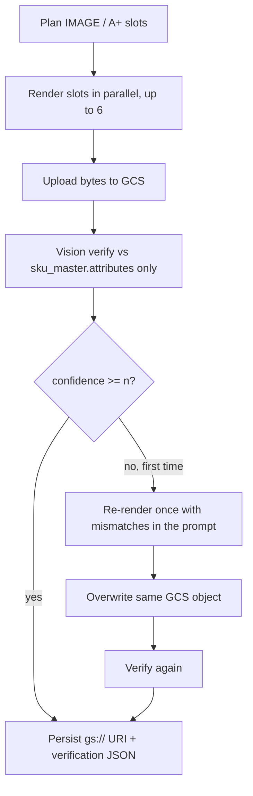

# Image attribute verification — implementation plan

Agreed design for a post-render check on every **IMAGE** and **A_PLUS** slot. Branch: `feat/image-attribute-verification` (from `fix/content-generation`).

This is a **truthfulness** check: anything printed on the generated picture must not fight `sku_master.attributes`. It is not a visual match against source photos, and it is not a check that the slot printed its assigned generation facts.

---

## Goal

After every IMAGE and A_PLUS slot is rendered, a vision model (default GPT-4o, swappable via env) looks at the **generated image only** and compares on-image text/claims to the **full SKU product data** (`sku_master.attributes`). Product attributes are truthful.

- Confidence **≥ n** → keep the image, persist score + reasoning.
- Confidence **< n** → re-render that slot **once**, with mismatches injected into the prompt. Keep the **second** image even if it still scores low. Persist its result with `attempt: 2`.
- Low score does **not** fail the SKU job. Only render/upload failure fails IMAGE / A_PLUS, same as today.
- If the verifier itself errors: persist the image with `status: "error"`, **do not** auto-retry.

`n` is a **single Python constant**, default **80**. It is not an env var.

The model id **is** env: `OPENROUTER_VERIFY_MODEL=openai/gpt-4o`.

User-triggered image regen runs the same verify + one retry. Restore copies `verification` with the row.

Text attributes, listing fill, Download content, and the job-status poll payload are unchanged.

---

## What the user will see

**While the job runs**
Same progress bar as today. SKUs may take longer because each image gets a verify call, and some get a second render. Status is still PENDING → COMPLETED / FAILED. A low verification score does not mark the SKU failed.

**On the batch page (grid)**
Each PDP / A+ thumbnail keeps working as now (click to open). Extra:

- Small **confidence badge** on the tile, e.g. `92%` or `61%`.
- **Warning style** if below the snapshotted threshold (amber), **neutral** if at/above.
- A **retry hint** if the pipeline already re-rendered that slot (`attempt > 1`), e.g. `61% · retried`.
- Images generated **before** this feature have no badge (`verification` is null).

**When they click an image (existing regen modal)**
Under the picture, a short **Verification** block:

- Confidence: **61%**
- Hint if retried once
- Reason: *“Badge reads Queen; catalog Size is King.”*
- Mismatch list: `Size: catalog King, saw Queen` (or invented copy nowhere in PRODUCT DATA, including Description)

They can still type an improvement and regenerate. After a **user** regen, the new version is verified the same way (one auto-retry if below `n`). Compare view shows the new version’s score.

**What they will not see**

- No new pipeline step in the progress bar.
- No block on Download content / listing export.
- No first (discarded) image in the UI — only the image that was kept.
- No “doesn’t match source photo” language.

---

## Runtime flow (per SKU execute)

Text stage is unchanged. Image stage becomes:



**Retry is per slot, once.** Other slots are not affected. One failed *render/upload* still fails the IMAGE / A+ task, same as today. A *low verify score* does not.

If the **retry render** itself fails, keep the first image and its first verification rather than failing the slot.

**If the verifier itself errors** (timeout, bad JSON): do **not** auto-rerender (there is no mismatch to inject). Persist the image with `status: "error"` and no score. UI: “Verification unavailable.”

---

## Scoring rules

The verifier sees:

1. The **generated** image (signed HTTPS URL after GCS upload).
2. Full **PRODUCT DATA** (`sku_master.attributes`, empty keys already dropped; `source_assets` not sent). **Every key and every value is a fact** — including long fields such as Description. A claim is invented only if it is nowhere in that JSON.

It does **not** see source/reference product photos. It does **not** score against per-slot assigned facts (those stay a generation concern only).

| Situation | Effect |
|---|---|
| On-image text **contradicts** an attribute (Queen vs King) | Miss |
| Invented copy that appears in **no** PRODUCT DATA key or value (including Description) | Miss |
| SKU / ASIN / UPC / EAN / GTIN printed on the artwork | Miss (shopper image, not a label) |
| Overlay **omits** a catalog fact | Allowed — not a miss |
| Hero with little or no text | High score is allowed |
| Synonyms that mean the same fact (“King Size” vs “King”) | Match |
| Product **looks** different from source photos | Out of scope — ignored |

The model returns a **0–100** integer, a short reason, observed on-image text, and a mismatch list. Python only compares `confidence < MIN_CONFIDENCE_PERCENT`.

Retry addendum injects the mismatch list only (catalog vs observed). It must not say “match the reference photo.” Stored `prompt` stays the **original slot brief**; retry text is ephemeral so later user regen still starts from v1.

---

## What is stored where

Today each kept image is one row on **`sku_marketplace_attribute_value`**: `value` (`gs://…`), `prompt` (slot brief), `version`.

**New nullable JSONB column on that same row:** `verification`.

- `NULL` = never verified (legacy rows). Never persist `{}`.
- Versioned with the image: v1 = pipeline result; a user regen is a new version with its own verification. Restore copies the source row’s JSON forward (same as `prompt`).
- No GIN index. The blob is always loaded with the row. We are not querying “all slots under 80%.”

**Do not store in JSONB** (already on the row, the SKU, or derived in the UI):

| Data | Where it already is |
|---|---|
| Slot, version, gs:// URI | columns `slot`, `version`, `value` |
| Image-model brief | column `prompt` |
| Full SKU attribute bag | `sku_master.attributes` |
| Source photos | GCS; we are not comparing them |
| `passed` / `retried` booleans | `confidence >= threshold`, `attempt > 1` |
| Timestamps | row `created_at` |
| Per-slot assigned facts | generation only — not scored, not stored here |

**Successful check:**

```json
{
  "v": 1,
  "status": "ok",
  "model": "openai/gpt-4o",
  "confidence": 61,
  "threshold": 80,
  "attempt": 2,
  "reasoning": "Badge reads Queen; catalog Size is King.",
  "observed_text": ["Queen", "210"],
  "mismatches": [
    {
      "kind": "contradiction",
      "source_field": "Size",
      "catalog": "King",
      "observed": "Queen"
    }
  ]
}
```

**Verifier failed** (image still kept, no retry):

```json
{
  "v": 1,
  "status": "error",
  "model": "openai/gpt-4o",
  "attempt": 1,
  "error": "verify_tool_call_failed"
}
```

**Field rules**

- `v` — document version so we can change shape later.
- `status` — `"ok"` | `"error"` only.
- `model` — id actually used (swappable).
- `confidence` — integer 0–100, only when `status` is `ok`.
- `threshold` — the constant **at check time**, so old rows stay meaningful if we change `n`.
- `attempt` — `1` first keep, `2` after the one retry. No nested `first_attempt`.
- `reasoning` — short why; cap on write (~500 chars).
- `observed_text` — strings OCR’d off the picture; cap count/length on write.
- `mismatches.kind` — only **`contradiction`** | **`invented`**. For invented, `source_field` / `catalog` are null. No `missing` kind (omission vs catalog is allowed). `source_field` is the exact PRODUCT DATA key when mapped.

`confidence >= threshold` is computed in the client, not stored.

**GCS:** same object as today
`jobs/{job}/sku_generation_jobs/{sku_job}/images/{IMAGE|A_PLUS}_{slot}.{ext}`
Retry **overwrites** that object, then we insert the DB row once with the kept image + verification.

**Not stored:** listing export, job status payload, Cloud Workflow args.

**SQL to run before the app** (do not apply from the agent):

```sql
ALTER TABLE sku_marketplace_attribute_value
  ADD COLUMN verification jsonb NULL;
```

Existing rows stay `NULL` → UI shows no badge.

---

## Code changes

### Server — new pipeline module

`server/pipelines/generation/verify.py`

- `MIN_CONFIDENCE_PERCENT = 80` — the one constant.
- `verify_image(...)` → structured tool call on the verify model.
- Inputs: generated image URL + full product attributes. **No `ctx.product_image_urls`.**
- Output: a small dataclass matching the JSONB contract.

`server/pipelines/generation/tools.py` — `submit_image_verification` tool schema.

Retry addendum built in `verify.py` from the mismatch list.

### Server — orchestration

`server/services/job.py` → `_run_images`

Inside each slot worker, after a successful render:

1. Upload to GCS, sign URL.
2. Verify.
3. If `confidence < MIN_CONFIDENCE_PERCENT`, re-render with addendum, overwrite GCS, verify again (`attempt: 2`).
4. Persist `value` + original `prompt` + `verification`.

Same helper used from `regenerate_attribute_value` for **image** (not text). Restore copies `verification`.

`_persist_attribute_value` grows an optional `verification` argument.

### Server — API contract (client in the same change)

Add `verification` (nullable object) to:

- `SkuGenerationJobAttributeSlotResponse`
- `RegenerateAttributeValueResponse`
- `SkuGenerationJobExecutionResponse` attribute items (optional; UI mainly uses content GET)

Content GET and regen responses include it. Job **status** poll stays light (no per-slot verification).

### Server — config

New env (swappable model only):

```
OPENROUTER_VERIFY_MODEL=openai/gpt-4o
```

Add to `Settings`, `server/.env.example`, and Secret Manager `server.OPENROUTER_VERIFY_MODEL` on deploy (same pattern as the other OpenRouter model ids). Default in settings may be `openai/gpt-4o` so existing local `.env` still boots.

Threshold is **not** an env var.

### Client

- Types on `client/src/api/jobs.ts`.
- `ContentImage` + grid: badge (score, below-threshold, retried).
- `AttributeRegenTarget` + modal: Verification block; after regen, show the new version’s score.
- Styles in `index.css` next to existing `.pdp-tile__badge` / `.img-modal` rules.

### Tests

Focused unit tests around verify helpers: threshold, retry-once semantics, verifier error payload, verifier request must **not** include reference image URLs. No live OpenRouter calls.

---

## Other impact

| Area | Impact |
|---|---|
| **Time / cost** | +1 vision call per slot, +1 image gen + 1 vision call when below `n`. Worst case ~2× image time for many misses. Cloud Workflow execute timeout stays **10 minutes**. Large galleries that already retry renders could get close to that. Watch first production jobs. |
| **OpenRouter spend** | Extra GPT-4o vision tokens (generated image + attributes only — no source-photo tokens). Grouped with existing `session_id` (`user:brand`). |
| **SKU FAILED** | Unchanged. Only render/upload failure fails the attribute. Low score still COMPLETED. |
| **User retry of a FAILED SKU** | Re-runs PENDING/FAILED tasks only. Already-completed image slots are not re-verified. |
| **Listing / Download content** | No QA columns. Amazon/Dropbox still get the kept image. |
| **v1 prompt / regen** | Unchanged contract: v1 = slot brief, later versions = user note. Retry addendum is not stored on `prompt`. |
| **Fact board / planning** | Unchanged. Assigned facts still drive generation; verification does not score against that list. |
| **Source photos** | Still used at **render**. Never at **verify**. |
| **Deploy** | App code + the `ALTER TABLE` above + the new Secret Manager key. Ship order: **SQL first**, then app (column is nullable). |

---

## Out of scope

- Verifying generated **text** (title, bullets, etc.).
- Auto-fail or a third render.
- Keeping the discarded first image as its own version.
- Showing verification on the job list / progress bar.
- Visual identity vs source photos.
- Scoring whether a slot printed its assigned generation facts.
- Changing Cloud Workflow YAML unless 10 minutes proves too tight after this ships.

---

## Build order

1. SQL + entity/DTO + persist field (null-safe).
2. `verify.py` + tool + prompt (generated image + attributes only; no source photos).
3. Wire `_run_images` (verify + one retry + persist JSON).
4. User image regen path.
5. Client badge + modal.
6. Lint/build (`ruff`, client `lint` + `build`).
