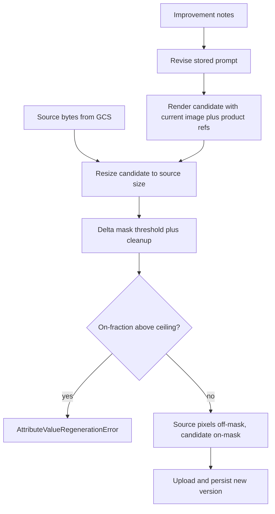

# Keep Frame on Image Edit - Plan

## Goal Capsule

**Objective.** When an operator regenerates a listing image with improvement notes, the new version applies only the requested change. Every other pixel stays identical to the image they edited.

**Product authority.** Session bootstrap. No requirements-only brainstorm artifact was written. Diagnosis of the live regenerate path is in this conversation: `regenerate_image` full-canvas re-renders with the current generated image as the primary OpenRouter reference.

**Stop conditions.** Do not ship a full-canvas candidate. If the edit cannot be localized (mask covers too much of the frame, or the candidate cannot be registered to the original), fail the regenerate with a domain error and leave the previous version as latest. Do not add a drawing/mask UI, a whole-new-scene restage mode, print-file compositing, or a sharpness-score gate in this slice.

**Execution.** Code on branch `feat/localized-image-edit` (from `main`). Do not mix with `feat/sku-preview-urls`.

---

## Product Contract

### Summary

Default image regenerate is an **Edit**: keep the frame; only the requested change may move. The compare / restore UI stays. Text regenerate is unchanged. A whole-new-scene restage from product photos is a later mode, not this plan.

### Problem Frame

Regenerate today revises the prompt, then asks the image model to paint a new canvas using the latest generated image as the first reference. Operators measured ~12–18% Laplacian-variance loss on the first regenerate. Untouched regions (a folded bedsheet) went uniformly softer. That is a full-canvas latent round-trip, not a local edit. Branching from version 1 would not have caught that V2. Prompt-only "don't change the rest" is the current design and is the failure.

### Actors

- A1. Opptra operator on batch preview. Identity of the person is not load-bearing for this slice.

### Requirements

#### Edit behavior

- R1. An image regenerate from improvement notes must keep every pixel outside the requested change identical to the source version the operator edited.
- R2. The requested change must still appear in the new version (the keep-frame rule is not "refuse all edits"). AE1 named result is the bar: the pillow is navy, not merely that some pixels moved.
- R3. If the system cannot localize the change, it must not persist a full-canvas re-render. Fail closed and keep the previous latest.

#### Existing regenerate contract

- R4. Image edit still uses the existing notes field, compare modal, use-new, and keep-previous (restore) path.
- R5. Text regenerate is unchanged.
- R6. First-time gallery / A+ generation is unchanged.

### Flows

- F1. Operator opens an image, enters notes, submits. Server returns a new version whose unedited pixels match the source. Compare shows source vs edited. Use-new keeps the edited version; keep-previous restores the source lineage as today.
- F2. Notes describe a change the compositor cannot isolate (whole-scene restyle, or candidate unaligned). Operator sees a regenerate failure; the previous latest remains.

### Acceptance Examples

- AE1. Notes say "make the pillow navy." The pillow is navy. Unedited regions (the bedsheet and other unmentioned pixels) match the source after decode — identical RGB, not a re-encoded JPEG of the whole frame. Covers R1, R2, F1.
- AE2. Notes say "completely restyle this as a lifestyle scene." Localization cannot isolate a region. Regenerate fails; latest version is still the source. Covers R3, F2.
- AE3. Operator regenerates title copy with notes. Image pipeline is not invoked. Covers R5.

### Success Criteria

Unedited regions of a successful image edit match the source pixels. Failed localization never becomes the latest image. Existing compare/restore still works.

### Scope Boundaries

**In scope.** Default image Edit on `POST /jobs/attribute-values/{id}/regenerate` for `IMAGE` values.

**Deferred for later.** Whole-new-scene restage from product photos only; operator-drawn masks; print-file compositing onto fabric; batch + Laplacian sharpness gate; first-generate quality work.

**Out of this slice.** Text regenerate, first generate, listing export, `feat/sku-preview-urls` work.

### Key Decisions

- KD1. Default regenerate is keep-the-frame Edit, not restage-from-photos and not a chaining-only patch that still full-re-renders. (session-settled: user-directed — chosen over restage-as-default and over chaining-only: the measured V2 was a full-canvas first regen, and the operator needs the rest of the frame to stay put.) Governs R1, R2, R3.
- KD2. Whole-new-scene restage and print-file compositing are not this plan. (session-settled: user-directed — chosen over building both modes in one slice: this invocation is Edit only.) Governs Scope Boundaries.
- KD3. Actor identity is not required to ship. (session-settled: user-directed — chosen over delaying for a named operator: "who does it does not matter at the moment.") Governs A1.

### Dependencies / Assumptions

- OpenRouter's Images API has no mask / inpaint field (`input_references` only). Native masked inpaint is not available through the current client.
- Prompt instructions alone cannot keep pixels identical; that is the live bug.
- Source and candidate can be decoded as raster images of a common size after a register step.
- Operators still enter free-text notes; no new UI control in this slice.

### Outstanding Questions

None blocking. Subtle whole-image lighting tweaks may fail R3's localization ceiling; that is accepted until a restage mode exists.

---

## Planning Contract

### Key Technical Decisions

- KTD1. Guarantee R1 in code by compositing, not by trusting the image model. After a candidate render, copy source pixels everywhere the edit mask is off. Prompt text may concentrate the delta; it is not the keep-frame guarantee. Instantiates KD1; Governs R1, R3.
- KTD2. Build a binary edit mask from per-pixel difference between the registered candidate and the source (threshold + morphological cleanup). No feather: copy source pixels unmodified wherever the mask is off. No operator-drawn mask and no OpenRouter mask parameter this slice. If the binary mask's on-fraction exceeds a configured ceiling (start at 35%), fail closed per R3. The RGB threshold must sit above incidental full-canvas round-trip noise so compositing restores the diagnosed softening rather than treating it as the edit. A notes-to-bbox crop-regen-paste was considered and not chosen: there is no region detector, and the existing full-candidate OpenRouter call plus composite reuses the current render path. Instantiates KD1; Governs R1, R3.
- KTD3. Still pass the current generated image as an alignment reference for the candidate (plus product photos as today) so the candidate stays registered to the source. Then lock source pixels outside the mask. Do not restage from product photos only in this slice — a shifted composition would light up the whole delta mask and trip R3. Instantiates KD2; Governs R1, R4.
- KTD4. Add `Pillow` for decode / resize / composite. The server has no image library today (`server/requirements.txt`). Use it only in the localize helper, not in the OpenRouter client.
- KTD5. Download the source from GCS via `GcsClient.object_name_from_gs_uri` + `download_bytes` (same pattern as `services/listing.py`), not via the signed URL fetch used for model references.
- KTD6. Text regenerate and first generate stay on their current functions. Image Edit is a post-step on the existing `regenerate_image` persist path in `services/job.py`.

### Assumptions

- Candidate and source share aspect ratio after snap (`IMAGE` 1:1, `A_PLUS` 3:2). Register by resizing the candidate to the source's pixel size before delta.
- A 35% on-fraction ceiling is a starting constant, not a product promise; tune only if AE2 false-positives in implementation.
- Threshold is on per-channel max-delta in 0-255 RGB, above incidental full-canvas round-trip noise, with a small morphology pass so JPEG/model noise does not speckle the mask. Compute on-fraction on the binary mask after morphology.
- Encode the composite as lossless PNG. When the mask is empty, return the original source bytes. Do not re-encode the full frame as JPEG.
- External research (OpenRouter Images API, 2026): no mask field. That finding is load-bearing for KTD2.

### High-Level Technical Design



Candidate generation stays lossy. The composite is what makes unedited pixels identical to the source.

### Implementation Constraints

- Follow existing regenerate errors: `AttributeValueRegenerationError` maps to HTTP 502.
- Keep `RegenerateAttributeValueRequest` as notes-only (`improvement`).
- Do not change Cloud Workflows or first-generate `_run_images`.
- New tests live under `server/tests/`; pytest from `server/` with `pythonpath = ["."]`.

### Sequencing

U1 (pure composite helper + tests) before U2 (wire regenerate). U3 (prompt localization hint) can land with U2. U4 (modal copy) last and optional if time is tight — behavior does not depend on it.


### System-Wide Impact

Keep-frame is a post-render step on the operator IMAGE regenerate HTTP path only. Workflows first-generate does not share it.

- **Entry.** `POST /jobs/attribute-values/{id}/regenerate` -> `regenerate_attribute_value`. After `regenerate_image` returns candidate bytes, download source `gs://` from `latest.value` (`object_name_from_gs_uri` + `download_bytes`, same as listing), run U1, then upload and persist. Applies to every `AttributeDataType.IMAGE` value (gallery and A+ slots).
- **Failure.** Localize must run before `_persist_attribute_value` (`base.save` commits immediately). On fail-closed, no new version row; gallery signed URL stays. `AttributeValueRegenerationError` maps to HTTP 502 `detail` using the U2 operator-facing string. The modal stays on the edit form and shows `detail`. Do not add a new status code.
- **Objects.** Success uploads composited bytes to the existing regen key shape `..._v{latest.version+1}`. Fail-closed writes nothing; a retry reuses the same next version number. `external_id` is unchanged. Listing already reads latest IMAGE `gs://`.
- **Must not change.** Cloud Workflows, `_run_images` / first-generate, TEXT regenerate, `restore_attribute_value_version`, listing/Dropbox export, content GET, first-gen GCS key shape (no `_vN`), HTTP mappings besides the existing 502.
- **U3 constraint.** Keep-frame prompt hint belongs on the revise/regen IMAGE path. Do not add it to `ensure_image_render_suffix` (shared with first-generate).
- **U4.** IMAGE modal copy only; same POST body/response.


---

## Implementation Units

### U1. Pixel localize helper

**Goal.** A testable function that takes source bytes and candidate bytes and returns composited bytes, or raises when localization is impossible.

**Requirements.** R1, R3.

**Dependencies.** None.

**Files.**
- `server/pipelines/generation/localize.py` (create)
- `server/tests/test_image_localize.py` (create)
- `server/requirements.txt` (add Pillow)

**Approach.**
1. Decode both rasters; resize candidate to source size. Skip resample when sizes already match.
2. Build a binary mask from per-pixel RGB max-delta vs a threshold; close/open speckle. Do not feather.
3. Compute on-fraction on that binary mask. If on-fraction > ceiling, raise a dedicated error the job service maps to `AttributeValueRegenerationError`.
4. Copy source pixels where the mask is off and candidate pixels where it is on. Encode PNG. If the mask is empty, return the original source bytes.
5. Execution note: Implement the helper test-first with synthetic images. Do not call OpenRouter here.

**Patterns to follow.** Small frozen dataclasses in `pipelines/generation/` (`RevisedPrompt`, `ImageGeneration`). Keep I/O out of this module.

**Test scenarios.**
- Happy path: source and candidate identical except a solid rectangle; decoded output matches source outside the rectangle and candidate inside. Covers AE1.
- Edge: identical images → empty mask → helper returns the original source bytes.
- Edge: size mismatch → candidate resized; mask still localizes the rectangle.
- Edge: faint requested-change rectangle still appears in the composite (on-fraction under ceiling), so the helper does not keep source pixels for a subtle requested delta.
- Error: globally shifted candidate (every pixel beyond threshold) → on-fraction over ceiling → raises. Covers AE2.
- Error: undecodable bytes → raises.

**Verification.** `pytest tests/test_image_localize.py` from `server/` is green. Pillow is in `requirements.txt`.

### U2. Wire image regenerate through localize

**Goal.** Successful image regenerate persists the composited image, not the raw model canvas. Failed localization does not bump latest.

**Requirements.** R1, R2, R3, R4. KTD1, KTD3, KTD5, KTD6.

**Dependencies.** U1.

**Files.**
- `server/services/job.py`
- `server/tests/test_regenerate_localize.py` (create)

**Approach.**
1. After `regenerate_image` returns candidate bytes, load source bytes from `latest.value` via GCS.
2. Run U1. On success, upload PNG composite bytes with `content_type` `image/png` (via `files.extension_for_image_content_type`) and persist.
3. On localize failure, do not call `_persist_attribute_value`; raise `AttributeValueRegenerationError` with operator-facing detail: "This change could not be kept local to your notes. Try a more specific object or color, or keep the current image. Whole-scene restyles are not supported here."
4. Leave `revise_prompt` and reference ordering as alignment: current output first, then product refs (KTD3).
5. Execution note: Mock OpenRouter and GCS. Assert persist is skipped when localize raises. Assert uploaded bytes are the PNG composite, not the mock candidate.

**Patterns to follow.** `regenerate_attribute_value` in `services/job.py`; listing's `object_name_from_gs_uri` + `download_bytes`.

**Test scenarios.**
- Happy path: mocked candidate differs in one region; persisted value is composite; version bumps. Covers F1 / AE1.
- Error: localize raises → no new attribute-value row; error surfaces as regenerate failure. Covers F2 / AE2.
- Integration: IMAGE path calls localize; TEXT path never does. Covers AE3 / R5.

**Verification.** `pytest tests/test_regenerate_localize.py tests/test_image_localize.py` from `server/` is green. Manual OpenRouter regen is not required to merge the unit.

### U3. Prompt hint for a concentrated delta

**Goal.** The revised image prompt tells the model to change only what the notes ask, so the delta mask has a chance to stay under the ceiling.

**Requirements.** R2. Supports R1; does not replace KTD1.

**Dependencies.** U2.

**Files.**
- `server/pipelines/generation/prompts.py`
- `server/pipelines/generation/regenerate.py`
- `server/tests/test_regenerate_localize.py` (extend)

**Approach.**
1. Add a short, stable instruction on the image-edit-only revise/regen path: change only the user-requested region; do not restyle or resharpen the rest of the frame. Required files: `prompts.py` and `regenerate.py`. Do not put this on `ensure_image_render_suffix` (shared with first-generate).
2. Keep `revise_generation_prompt` as the leave-unchanged product-fact reviser.
3. Do not claim this instruction keeps pixels identical.

**Patterns to follow.** `revise_generation_prompt` in `prompts.py` (product-fact rules stay). Do not use `ensure_image_render_suffix` for the keep-frame hint.

**Test scenarios.**
- Happy path: revised or render prompt for IMAGE includes the keep-frame instruction when improvement notes are present.
- Edge: TEXT revise prompt does not include image keep-frame copy.

**Verification.** Prompt tests pass without network.

### U4. Preview copy that Edit keeps the rest of the frame

**Goal.** The regenerate modal states that only the requested change should move, so operators do not expect a whole-new scene from this control.

**Requirements.** R4.

**Dependencies.** None (can ship after U2).

**Files.**
- `client/src/components/batch-content/AttributeRegenModal.tsx`

**Approach.** One helper paragraph immediately below the IMAGE notes field: "Only the requested change should move; everything else stays as-is." Replace the IMAGE placeholder with an AE1-style local edit (`describe what to change: "make the pillow navy"`). Leave the TEXT placeholder and compare-phase copy unchanged. No new controls, no mask canvas, no restage toggle.

**Patterns to follow.** Existing modal copy and hint style on `BatchContent.tsx`.

**Test scenarios.**
- Test expectation: none -- copy-only; verify by reading the IMAGE edit phase in the modal.

**Verification.** IMAGE modal shows the line; TEXT modal does not.

---

## Verification Contract

From `server/` (venv with `requirements.txt` + `requirements-dev.txt`):

```text
pytest tests/test_image_localize.py tests/test_regenerate_localize.py -q
ruff check pipelines/generation/localize.py pipelines/generation/regenerate.py pipelines/generation/prompts.py services/job.py tests/test_image_localize.py tests/test_regenerate_localize.py
```

Existing `tests/test_auth_flow.py` and `tests/test_auth_policy.py` must still pass. There is no regenerate coverage on `main` today; these files are the regression home.

`release:validate` does not apply. No skill eval. Live OpenRouter proof is optional after merge, using AE1 on a real SKU image.

---

## Definition of Done

- R1-R6 are implemented or explicitly unchanged (R5, R6).
- U1-U3 merged on `feat/localized-image-edit`; U4 if the modal copy is in the same PR.
- Failed localization never writes a new latest image.
- Abandoned experiments (extra mask UIs, sharpness gates, restage flags) are not in the diff.
- Work is not on `feat/sku-preview-urls`.

### Per-unit done

- U1. Helper + tests + Pillow pin.
- U2. Job path composites; failure skips persist.
- U3. Image-edit prompt contains the keep-frame hint.
- U4. IMAGE modal copy present, or explicitly dropped from the PR with no other UI leftovers.

---

## Risks & Dependencies

- **OpenRouter has no mask API.** Mitigation: KTD2 composite. If a future provider adds inpaint, it can replace the candidate step without changing R1.
- **False fail on global notes** ("warmer lighting"). Mitigation: R3 fail closed; restage mode later.
- **False keep on a subtle requested change** (delta under threshold). Mitigation: faint-rectangle U1 test; keep the threshold above incidental round-trip noise; tune once if AE1 false-keeps.
- **False fail on typical local edits** if the threshold sits inside full-canvas round-trip noise. Mitigation: KTD2 threshold-above-noise; synthetic U1/U2 remain the merge gate. Live OpenRouter on-fraction is optional post-merge tune, not a merge blocker. If a live AE1-class regen exceeds the 35% ceiling, retune constants before calling production done.
- **Pillow in the API process.** Mitigation: localize only on the operator regenerate path, not on Workflows SKU execute.
- **Open PR 30 (`fix/regeneration`)** is text caps + gallery fact-grounding, not this bug. Do not treat it as a duplicate fix.

## Sources & Research

- Live path: `server/pipelines/generation/regenerate.py`, `server/services/job.py` (`regenerate_attribute_value`), `server/core/clients/openrouter.py` (`generate_gemini_image` / `generate_gpt_image`), `client/src/components/batch-content/AttributeRegenModal.tsx`.
- OpenRouter Images API: `input_references`, no mask field (docs, 2026).
- GCS download pattern: `server/services/listing.py` + `GcsClient.object_name_from_gs_uri`.
- Grounding dossier (session scratch): regenerate feeds current output + product refs; no inpaint/sharpness/upscale in repo.
- Product Contract preservation: bootstrap (no upstream requirements-only plan).
